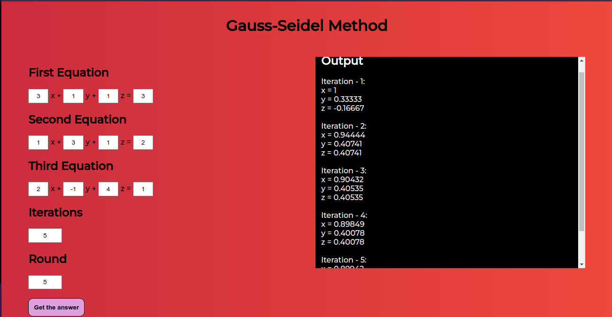

# Gauss-Seidel Method

In numerical linear algebra, the Gauss–Seidel method, also known as the Liebmann method or the method of successive displacement, is an iterative method used to solve a system of linear equations. It is named after the German mathematicians Carl Friedrich Gauss and Philipp Ludwig von Seidel, and is similar to the Jacobi method. Though it can be applied to any matrix with non-zero elements on the diagonals, convergence is only guaranteed if the matrix is either strictly diagonally dominant, or symmetric and positive definite. It was only mentioned in a private letter from Gauss to his student Gerling in 1823. A publication was not delivered before 1874 by Seidel.

<i>Source: Wikipedia</i>

This website determines the solution of set of 3 variable equations by using Gauss-Seidel Method.

 

# Snapshot

 

Licensed Under MIT License

Copyright (c) 2022 Subhendu Dash
